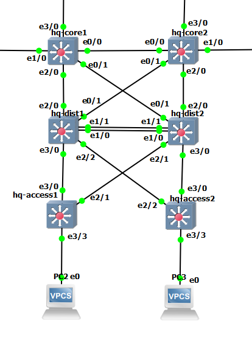
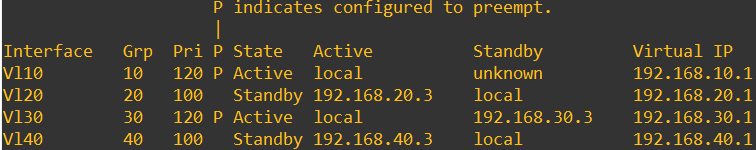
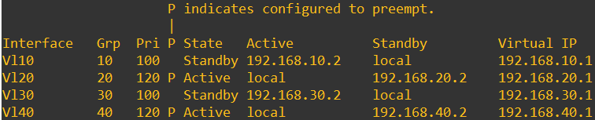
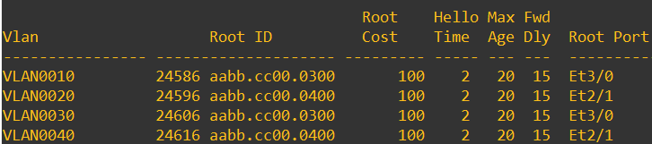

# Enterprise Network GNS3

## Overview

CCNP-level enterprise network lab built in GNS3 featuring a three-tier campus architecture, multi-area OSPF, BGP, redundancy, and network segmentation.

The lab consists of a headquarters campus, two branch sites, and redundant Internet connectivity through two simulated ISPs.

## Network Topology


## Addressing Plan

### Headquarter

Internal transit address pool: `172.16.1.0/24`

| VLAN | Purpose | Subnet |
|------|---------|--------|
| 10 | Users | `192.168.10.0/24` |
| 20 | Servers | `192.168.20.0/24` |
| 30 | Guests | `192.168.30.0/24` |
| 40 | Management | `192.168.40.0/24` |

### Branch 1

OSPF Area 10

LAN: `192.168.2.0/24`

### Branch 2

OSPF Area 20

LAN: `192.168.3.0/24`

### BGP Peering Networks

External BGP transit address pool: `172.16.2.0/24`

- ISP1 <-> HQ: `172.16.2.0/30`
- ISP2 <-> HQ: `172.16.2.4/30`

## Routing

- OSPF is used as the internal routing protocol.
- HQ operates in OSPF Area 0.
- Branch 1 operates in OSPF Area 10.
- Branch 2 operates in OSPF Area 20.
- eBGP is used for connectivity to the simulated ISPs.
- Enterprise AS: `65000`
- ISP1 AS: `65100`
- ISP2 AS: `65200`

## HQ Layer 2 and Gateway Redundancy

The HQ campus uses a redundant distribution design with two distribution switches and two access switches.

VLANs are extended between the access and distribution layers using 802.1Q trunks. EtherChannel is used between the distribution switches to provide additional link redundancy and bandwidth.

Rapid-PVST is used to control the Layer 2 topology, while HSRP provides redundant default gateways for the HQ VLANs.

To utilize both distribution switches during normal operation, HSRP and STP roles are distributed across the VLANs:

| VLAN | Purpose | HSRP Active | STP Root |
|------|---------|-------------|----------|
| 10 | Users | hq-dist1 | hq-dist1 |
| 20 | Servers | hq-dist2 | hq-dist2 |
| 30 | Guests | hq-dist1 | hq-dist1 |
| 40 | Management | hq-dist2 | hq-dist2 |

Aligning the HSRP active gateway with the STP root keeps the preferred Layer 2 forwarding path and default gateway on the same distribution switch.

### HQ Topology



### HSRP Verification

`hq-dist1` is the preferred active gateway for VLANs 10 and 30.



`hq-dist2` is the preferred active gateway for VLANs 20 and 40.



### Rapid-PVST Verification

The access switches prefer `hq-dist1` as the STP root for VLANs 10 and 30, while `hq-dist2` is preferred for VLANs 20 and 40.



## Troubleshooting Notes

### HSRP multicast issue in GNS3

During HSRP configuration, both distribution switches initially entered the Active state even though Layer 3 connectivity between their SVIs was working.

HSRP debugging showed outgoing hello messages but no received hellos. The issue was isolated to multicast forwarding in the emulated IOU switch image.

As a lab-specific workaround, IGMP snooping was disabled on the affected VLANs:

```text
no ip igmp snooping vlan 10
no ip igmp snooping vlan 20
no ip igmp snooping vlan 30
no ip igmp snooping vlan 40
```

After this change, HSRP peers were able to exchange hello messages and establish the expected Active/Standby roles.

This is treated as an emulation-specific workaround rather than part of the intended production network design.