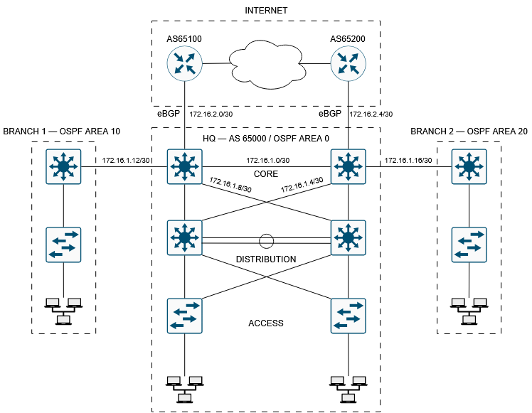

# Enterprise Network GNS3

## Overview

CCNP-level enterprise network lab built in GNS3 featuring a three-tier campus architecture, multi-area OSPF, BGP, redundancy, and network segmentation.

The lab consists of a headquarters campus, two branch sites, and redundant Internet connectivity through two simulated ISPs.

## Network Topology

## Addressing Plan

### Headquarter

Internal transit address pool: `172.16.1.0/24`

| VLAN | Purpose | Subnet |
|------|---------|--------|
| 10 | Users | `192.168.10.0/24` |
| 20 | Servers | `192.168.20.0/24` |
| 30 | Guests | `192.168.30.0/24` |
| 40 | Management | `192.168.40.0/24` |

### Branch 1

OSPF Area 10

LAN: `192.168.2.0/24`

### Branch 2

OSPF Area 20

LAN: `192.168.3.0/24`

### BGP Peering Networks

External BGP transit address pool: `172.16.2.0/24`

- ISP1 <-> HQ: `172.16.2.0/30`
- ISP2 <-> HQ: `172.16.2.4/30`

## Routing

- OSPF is used as the internal routing protocol.
- HQ operates in OSPF Area 0.
- Branch 1 operates in OSPF Area 10.
- Branch 2 operates in OSPF Area 20.
- eBGP is used for connectivity to the simulated ISPs.
- Enterprise AS: `65000`
- ISP1 AS: `65100`
- ISP2 AS: `65200`